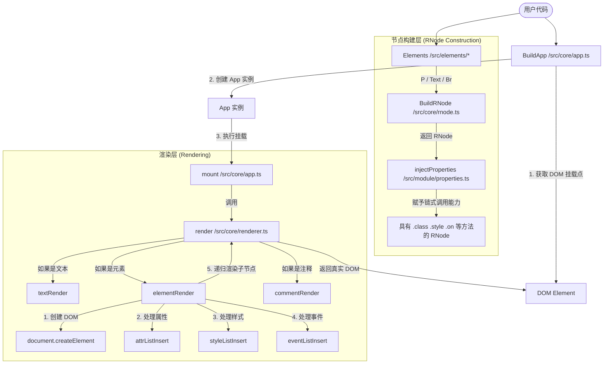

# RawFox JS

  

## 简洁、易读

无依赖，无侵入，支持无`css`构建。

```js
App(
	Text("Hello World"),
  	P(
        Text("网站标题"),
        Br().class("divider"),
        Text("—— 一个很牛的介绍"),
    )
    .class("header")
    .style("font-size", "24px")
    .style("font-weight", "bold")
    .style("padding", "16px")
    .attr("data-role", "header"),
)
```

## 使用方法

**ES Modules**

```js
import { BuildApp, Text, P, Br } from 'rawfox'
const App = BuildApp({
    mount: "#app",
  	globalStyle: {
       //全局样式注入
    }
})

App(
    P(
        Text("Hello World"),
        Br(),
        Text("This is RawFox."),
        Br(),
        Text("Follow us from GitHub!")
    )
    .style("font-size", "2em")
    .style("background", "linear-gradient(to right, red, blue)")
    .style("background-clip", "text")
    .style("color", "transparent")
    .style("font-weight", "100")
)
```

推荐使用`Vite`构建RawFox项目

**浏览器**

```html
<!DOCTYPE html>
<html lang="en">
<head>
    <meta charset="UTF-8">
    <meta name="viewport" content="width=device-width, initial-scale=1.0">
    <title>Document</title>
    <script src="./js/rawfox.js"></script> <!--导入RawFox IIFE版本-->
</head>
<body>
    <script>
        const { BuildApp, Text, P, Br } = rawfox
        const App = BuildApp({
            mount: "body"
        })
        App(
            P(
                Text("Hello World"),
                Br(),
                Text("This is RawFox."),
                Br(),
                Text("Follow us from GitHub!")
            )
            .style("font-size", "2em")
            .style("background", "linear-gradient(to right, red, blue)")
            .style("background-clip", "text")
            .style("color", "transparent")
            .style("font-weight", "100")
        )
  	</script>
</body>
</html>
```

## 自定义组件

```js
export function P(...args: RNode[]) { // 嵌套组件
    //写入你的特殊代码
    return BuildRNode("element", args, "p").injectProperties({ //通过BuildRNode函数返回组件实例
      a(){
        //特殊方法，为组件定制方法
      }
    }) 
}
```

## 框架原理

### 核心运行流程



